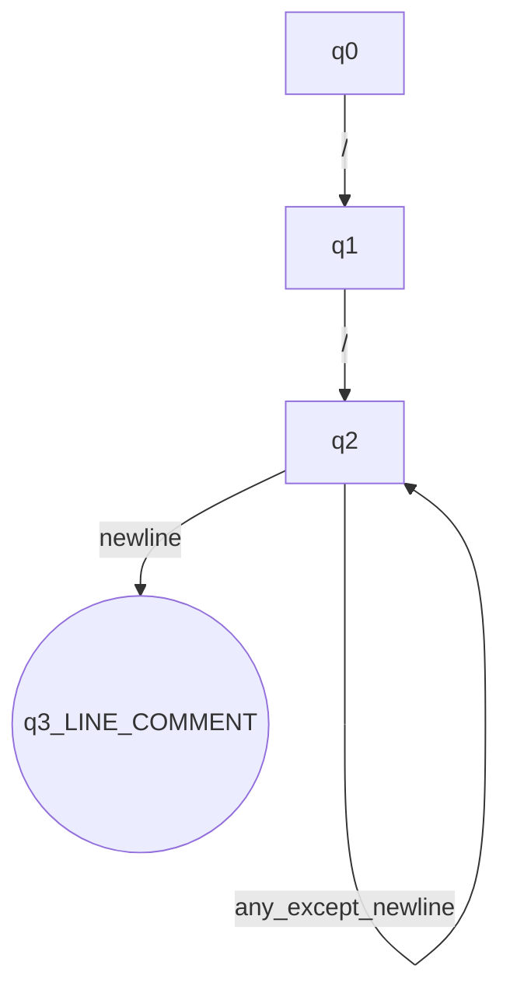
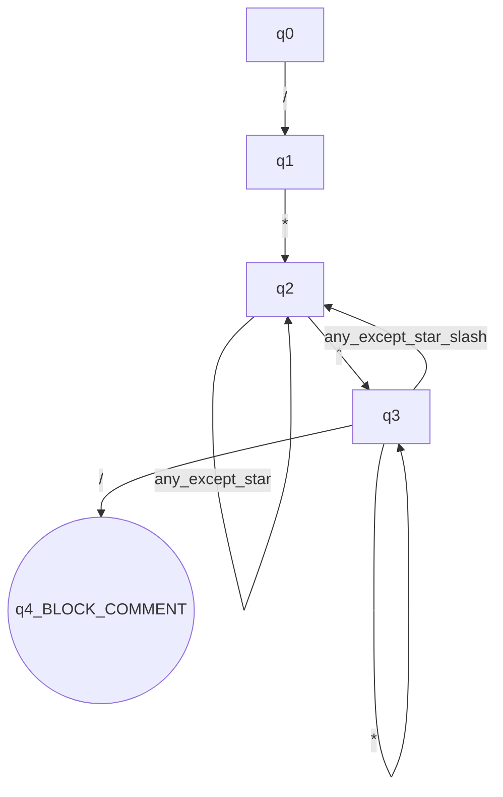

```mermaid
graph TD
    q0[q0] --> |/| q1[q1]
    q1 --> |/| q2[q2]
    q2 --> |any_except_newline| q2
    q2 --> |newline| q3((q3_LINE_COMMENT))
```

```mermaid
graph TD
    q0[q0] --> |/| q1[q1]
    q1 --> |*| q2[q2]
    q2 --> |any_except_star| q2
    q2 --> |*| q3[q3]
    q3 --> |any_except_star_slash| q2
    q3 --> |*| q3
    q3 --> |/| q4((q4_BLOCK_COMMENT))
```