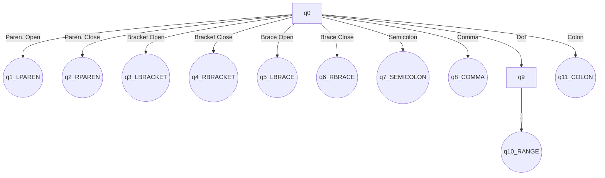

```mermaid
graph TD
    q0[q0] --> |Paren. Open| q1((q1_LPAREN))
    q0 --> |Paren. Close| q2((q2_RPAREN))
    q0 --> |Bracket Open| q3((q3_LBRACKET))
    q0 --> |Bracket Close| q4((q4_RBRACKET))
    q0 --> |Brace Open| q5((q5_LBRACE))
    q0 --> |Brace Close| q6((q6_RBRACE))
    q0 --> |Semicolon| q7((q7_SEMICOLON))
    q0 --> |Comma| q8((q8_COMMA))
    q0 --> |Dot| q9[q9]
    q9 --> |..| q10((q10_RANGE))
    q0 --> |Colon| q11((q11_COLON))
```
