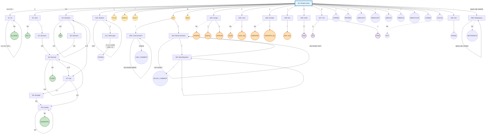

```mermaid
graph TD
    %% ========================================
    %% ESTADO INICIAL UNIFICADO
    %% ========================================
    S0[S0: Estado Inicial]
    
    %% ========================================
    %% MÓDULO: IDENTIFICADORES
    %% ========================================
    S0 -->|a-z, A-Z, _| S1[S1: ID]
    S1 -->|a-z, A-Z, 0-9, _| S1
    S1 -.->|fim| ID_F((ID_FINAL))
    
    %% ========================================
    %% MÓDULO: NÚMEROS
    %% ========================================
    
    %% Inteiros
    S0 -->|0| S2[S2: Zero]
    S0 -->|1-9| S3[S3: NonZero]
    S3 -->|0-9| S3
    S2 -.->|fim| INT0_F((INT: 0))
    S3 -.->|fim| INT_F((INT))
    
    %% Decimais
    S2 -->|.| S4[S4: DecZero]
    S3 -->|.| S5[S5: DecNum]
    S4 -->|0-9| S6[S6: Decimal]
    S5 -->|0-9| S6
    S6 -->|0-9| S6
    S6 -.->|fim| FLOAT_F((FLOAT))
    
    %% Científico
    S3 -->|e, E| S7[S7: Exp]
    S6 -->|e, E| S7
    S7 -->|+, -| S8[S8: ExpSign]
    S7 -->|0-9| S9[S9: ExpDig]
    S8 -->|0-9| S9
    S9 -->|0-9| S9
    S9 -.->|fim| SCI_F((SCIENTIFIC))
    
    %% ========================================
    %% MÓDULO: STRINGS
    %% ========================================
    S0 -->|\""| S10[S10: StrStart]
    S10 -->|char| S10
    S10 -->|\\| S11[S11: StrEscape]
    S11 -->|", \\, n, t, r| S10
    S10 -->|"| S12((STRING))
    
    %% ========================================
    %% MÓDULO: OPERADORES ARITMÉTICOS
    %% ========================================
    S0 -->|+| PLUS((PLUS))
    S0 -->|-| MINUS((MINUS))
    S0 -->|*| MULT((MULT))
    S0 -->|/| DIV((DIV))
    S0 -->|%| MOD((MOD))
    
    %% ========================================
    %% MÓDULO: OPERADORES DE ATRIBUIÇÃO E COMPARAÇÃO
    %% ========================================
    S0 -->|=| S20[S20: Assign]
    S20 -.->|fim| ASSIGN((ASSIGN))
    S20 -->|=| EQUAL((EQUAL))
    S20 -->|>| ARROW((ARROW))
    
    %% ========================================
    %% MÓDULO: OPERADORES RELACIONAIS
    %% ========================================
    S0 -->|<| S25[S25: Less]
    S25 -.->|fim| LESS((LESS))
    S25 -->|=| LESS_EQ((LESS_EQ))
    
    S0 -->|>| S28[S28: Greater]
    S28 -.->|fim| GREATER((GREATER))
    S28 -->|=| GREATER_EQ((GREATER_EQ))
    
    S0 -->|!| S30[S30: Not]
    S30 -->|=| NOT_EQ((NOT_EQ))
    
    %% ========================================
    %% MÓDULO: OPERADORES LÓGICOS
    %% ========================================
    S0 -->|&| S35[S35: And1]
    S35 -->|&| AND((AND))
    
    S0 -->|"\|"| S37[S37: Or1]
    S37 -->|"\|"| OR((OR))
    S37 -->|>| PIPE((PIPE))
    
    %% ========================================
    %% MÓDULO: DELIMITADORES
    %% ========================================
    S0 -->|"("| LPAREN((LPAREN))
    S0 -->|")"| RPAREN((RPAREN))
    S0 -->|"["| LBRACKET((LBRACKET))
    S0 -->|"]"| RBRACKET((RBRACKET))
    S0 -->|"{"| LBRACE((LBRACE))
    S0 -->|"}"| RBRACE((RBRACE))
    S0 -->|;| SEMICOLON((SEMICOLON))
    S0 -->|,| COMMA((COMMA))
    S0 -->|:| COLON((COLON))
    
    S0 -->|.| S40[S40: Dot]
    S40 -.->|fim| DOT((DOT))
    S40 -->|.| RANGE((RANGE))
    
    %% ========================================
    %% MÓDULO: COMENTÁRIOS
    %% ========================================
    DIV -->|/| S50[S50: LineComment]
    S50 -->|any except newline| S50
    S50 -->|newline| LINE_CMT((LINE_COMMENT))
    
    DIV -->|*| S52[S52: BlockComment]
    S52 -->|any except *| S52
    S52 -->|*| S53[S53: BlockMayEnd]
    S53 -->|/| BLOCK_CMT((BLOCK_COMMENT))
    S53 -->|any except / and *| S52
    S53 -->|*| S53
    
    %% ========================================
    %% MÓDULO: WHITESPACE
    %% ========================================
    S0 -->|space, tab, newline| S60[S60: Whitespace]
    S60 -->|space, tab, newline| S60
    S60 -.->|fim| WS((WHITESPACE))
    
    %% ========================================
    %% LEGENDA
    %% ========================================
    style S0 fill:#e1f5ff,stroke:#01579b,stroke-width:3px
    style ID_F fill:#c8e6c9,stroke:#2e7d32,stroke-width:2px
    style INT0_F fill:#c8e6c9,stroke:#2e7d32,stroke-width:2px
    style INT_F fill:#c8e6c9,stroke:#2e7d32,stroke-width:2px
    style FLOAT_F fill:#c8e6c9,stroke:#2e7d32,stroke-width:2px
    style SCI_F fill:#c8e6c9,stroke:#2e7d32,stroke-width:2px
    style PLUS fill:#ffecb3,stroke:#f57f17,stroke-width:2px
    style MINUS fill:#ffecb3,stroke:#f57f17,stroke-width:2px
    style MULT fill:#ffecb3,stroke:#f57f17,stroke-width:2px
    style DIV fill:#ffecb3,stroke:#f57f17,stroke-width:2px
    style MOD fill:#ffecb3,stroke:#f57f17,stroke-width:2px
    style ASSIGN fill:#ffe0b2,stroke:#e65100,stroke-width:2px
    style EQUAL fill:#ffe0b2,stroke:#e65100,stroke-width:2px
    style ARROW fill:#ffe0b2,stroke:#e65100,stroke-width:2px
    style LESS fill:#ffe0b2,stroke:#e65100,stroke-width:2px
    style LESS_EQ fill:#ffe0b2,stroke:#e65100,stroke-width:2px
    style GREATER fill:#ffe0b2,stroke:#e65100,stroke-width:2px
    style GREATER_EQ fill:#ffe0b2,stroke:#e65100,stroke-width:2px
    style NOT_EQ fill:#ffe0b2,stroke:#e65100,stroke-width:2px
    style AND fill:#f3e5f5,stroke:#4a148c,stroke-width:2px
    style OR fill:#f3e5f5,stroke:#4a148c,stroke-width:2px
    style PIPE fill:#f3e5f5,stroke:#4a148c,stroke-width:2px 
```