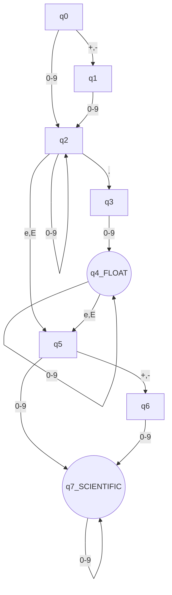

```mermaid
graph TD
    q0[q0] --> |+,-| q1[q1]
    q0 --> |0-9| q2[q2]
    q1 --> |0-9| q2
    
    q2 --> |0-9| q2
    q2 --> |.| q3[q3]
    q2 --> |e,E| q5[q5]
    
    q3 --> |0-9| q4((q4_FLOAT))
    q4 --> |0-9| q4
    q4 --> |e,E| q5
    
    q5 --> |+,-| q6[q6]
    q5 --> |0-9| q7((q7_SCIENTIFIC))
    q6 --> |0-9| q7
    q7 --> |0-9| q7
```