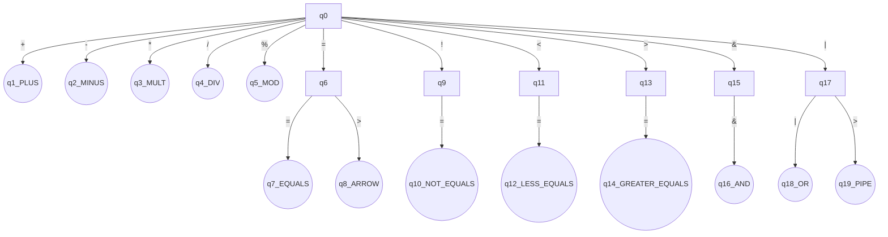

```mermaid
graph TD
    q0[q0] --> |+| q1((q1_PLUS))
    q0 --> |-| q2((q2_MINUS))
    q0 --> |*| q3((q3_MULT))
    q0 --> |/| q4((q4_DIV))
    q0 --> |%| q5((q5_MOD))

    q0 --> |=| q6[q6]
    q6 --> |=| q7((q7_EQUALS))
    q6 --> |>| q8((q8_ARROW))

    q0 --> |!| q9[q9]
    q9 --> |=| q10((q10_NOT_EQUALS))

    q0 --> |<| q11[q11]
    q11 --> |=| q12((q12_LESS_EQUALS))

    q0 --> |>| q13[q13]
    q13 --> |=| q14((q14_GREATER_EQUALS))

    q0 --> |&| q15[q15]
    q15 --> |&| q16((q16_AND))

    q0 --> |"|"| q17[q17]
    q17 --> |"|"| q18((q18_OR))
    q17 --> |>| q19((q19_PIPE))
```
