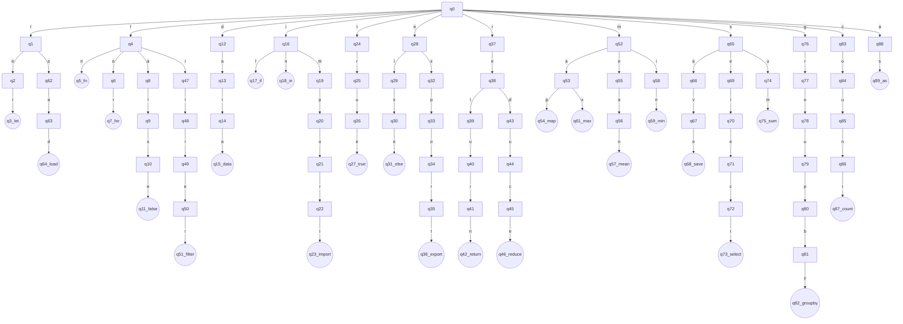

```mermaid
graph TD
    q0[q0] --> |l| q1[q1]
    q1 --> |e| q2[q2]
    q2 --> |t| q3((q3_let))
    
    q0 --> |f| q4[q4]
    q4 --> |n| q5((q5_fn))
    q4 --> |o| q6[q6]
    q6 --> |r| q7((q7_for))
    q4 --> |a| q8[q8]
    q8 --> |l| q9[q9]
    q9 --> |s| q10[q10]
    q10 --> |e| q11((q11_false))
    q4 --> |i| q47[q47]
    q47 --> |l| q48[q48]
    q48 --> |t| q49[q49]
    q49 --> |e| q50[q50]
    q50 --> |r| q51((q51_filter))
    
    q0 --> |d| q12[q12]
    q12 --> |a| q13[q13]
    q13 --> |t| q14[q14]
    q14 --> |a| q15((q15_data))
    
    q0 --> |i| q16[q16]
    q16 --> |f| q17((q17_if))
    q16 --> |n| q18((q18_in))
    q16 --> |m| q19[q19]
    q19 --> |p| q20[q20]
    q20 --> |o| q21[q21]
    q21 --> |r| q22[q22]
    q22 --> |t| q23((q23_import))
    
    q0 --> |t| q24[q24]
    q24 --> |r| q25[q25]
    q25 --> |u| q26[q26]
    q26 --> |e| q27((q27_true))
    
    q0 --> |e| q28[q28]
    q28 --> |l| q29[q29]
    q29 --> |s| q30[q30]
    q30 --> |e| q31((q31_else))
    q28 --> |x| q32[q32]
    q32 --> |p| q33[q33]
    q33 --> |o| q34[q34]
    q34 --> |r| q35[q35]
    q35 --> |t| q36((q36_export))
    
    q0 --> |r| q37[q37]
    q37 --> |e| q38[q38]
    q38 --> |t| q39[q39]
    q39 --> |u| q40[q40]
    q40 --> |r| q41[q41]
    q41 --> |n| q42((q42_return))
    q38 --> |d| q43[q43]
    q43 --> |u| q44[q44]
    q44 --> |c| q45[q45]
    q45 --> |e| q46((q46_reduce))
    
    q0 --> |m| q52[q52]
    q52 --> |a| q53[q53]
    q53 --> |p| q54((q54_map))
    q52 --> |e| q55[q55]
    q55 --> |a| q56[q56]
    q56 --> |n| q57((q57_mean))
    q52 --> |i| q58[q58]
    q58 --> |n| q59((q59_min))
    q53 --> |x| q61((q61_max))
    
    q1 --> |o| q62[q62]
    q62 --> |a| q63[q63]
    q63 --> |d| q64((q64_load))
    
    q0 --> |s| q65[q65]
    q65 --> |a| q66[q66]
    q66 --> |v| q67[q67]
    q67 --> |e| q68((q68_save))
    q65 --> |e| q69[q69]
    q69 --> |l| q70[q70]
    q70 --> |e| q71[q71]
    q71 --> |c| q72[q72]
    q72 --> |t| q73((q73_select))
    q65 --> |u| q74[q74]
    q74 --> |m| q75((q75_sum))
    
    q0 --> |g| q76[q76]
    q76 --> |r| q77[q77]
    q77 --> |o| q78[q78]
    q78 --> |u| q79[q79]
    q79 --> |p| q80[q80]
    q80 --> |b| q81[q81]
    q81 --> |y| q82((q82_groupby))
    
    q0 --> |c| q83[q83]
    q83 --> |o| q84[q84]
    q84 --> |u| q85[q85]
    q85 --> |n| q86[q86]
    q86 --> |t| q87((q87_count))
    
    q0 --> |a| q88[q88]
    q88 --> |s| q89((q89_as))
```