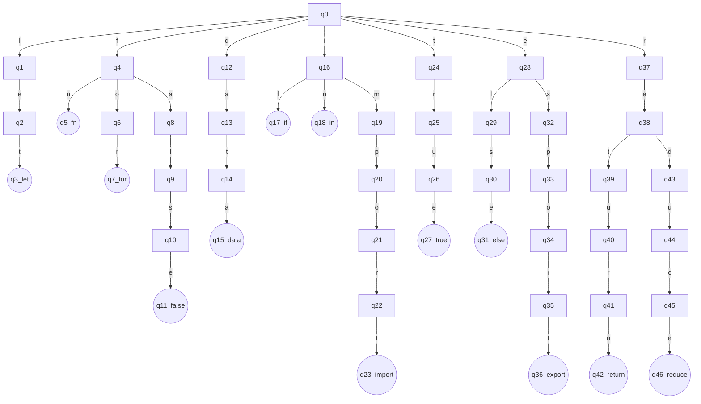

```mermaid
graph TD
    q0[q0] --> |l| q1[q1]
    q1 --> |e| q2[q2]
    q2 --> |t| q3((q3_let))
    
    q0 --> |f| q4[q4]
    q4 --> |n| q5((q5_fn))
    q4 --> |o| q6[q6]
    q6 --> |r| q7((q7_for))
    q4 --> |a| q8[q8]
    q8 --> |l| q9[q9]
    q9 --> |s| q10[q10]
    q10 --> |e| q11((q11_false))
    
    q0 --> |d| q12[q12]
    q12 --> |a| q13[q13]
    q13 --> |t| q14[q14]
    q14 --> |a| q15((q15_data))
    
    q0 --> |i| q16[q16]
    q16 --> |f| q17((q17_if))
    q16 --> |n| q18((q18_in))
    q16 --> |m| q19[q19]
    q19 --> |p| q20[q20]
    q20 --> |o| q21[q21]
    q21 --> |r| q22[q22]
    q22 --> |t| q23((q23_import))
    
    q0 --> |t| q24[q24]
    q24 --> |r| q25[q25]
    q25 --> |u| q26[q26]
    q26 --> |e| q27((q27_true))
    
    q0 --> |e| q28[q28]
    q28 --> |l| q29[q29]
    q29 --> |s| q30[q30]
    q30 --> |e| q31((q31_else))
    q28 --> |x| q32[q32]
    q32 --> |p| q33[q33]
    q33 --> |o| q34[q34]
    q34 --> |r| q35[q35]
    q35 --> |t| q36((q36_export))
    
    q0 --> |r| q37[q37]
    q37 --> |e| q38[q38]
    q38 --> |t| q39[q39]
    q39 --> |u| q40[q40]
    q40 --> |r| q41[q41]
    q41 --> |n| q42((q42_return))
    q38 --> |d| q43[q43]
    q43 --> |u| q44[q44]
    q44 --> |c| q45[q45]
    q45 --> |e| q46((q46_reduce))
```